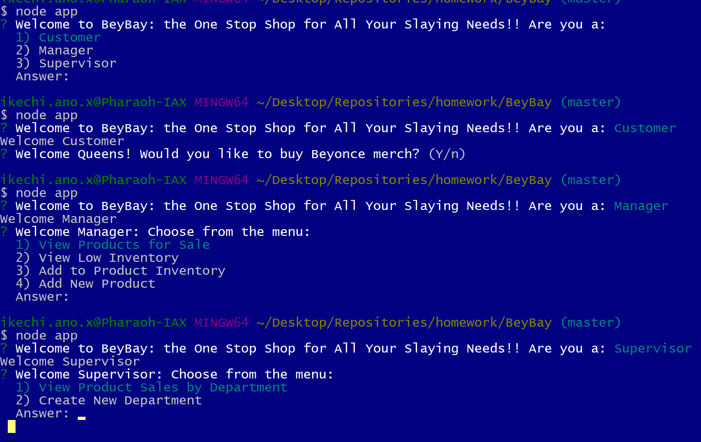
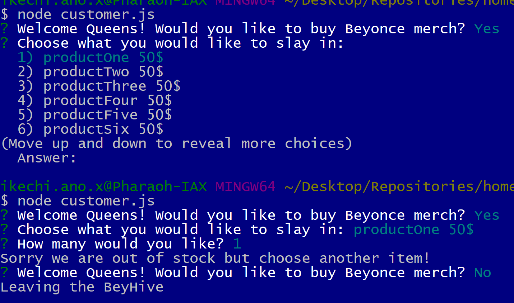
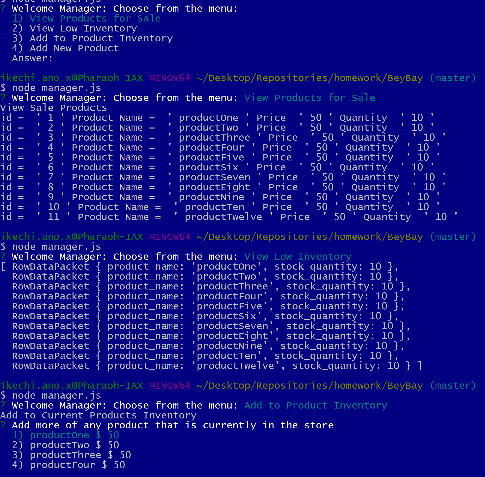
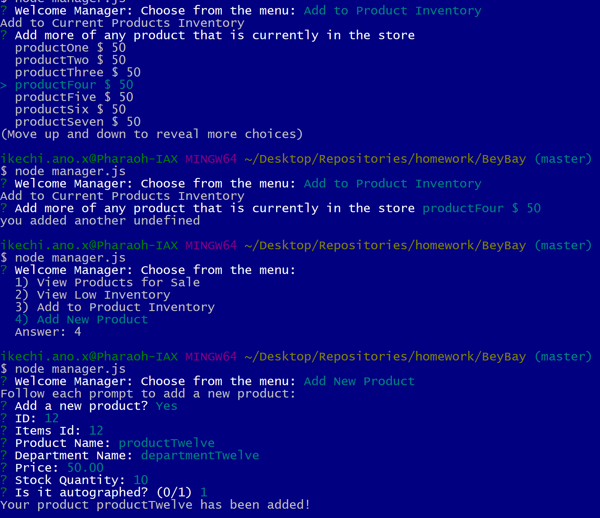
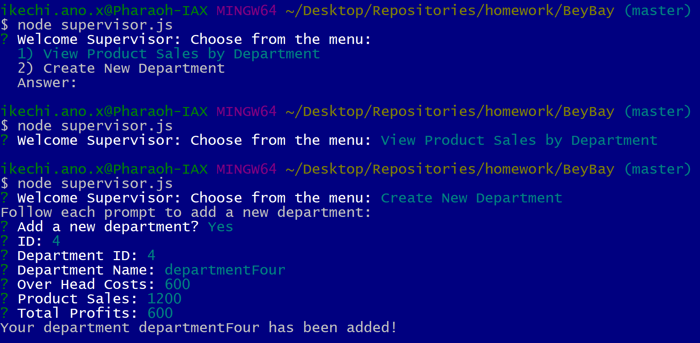

# BeyBay

## Overview

In this activity, I'll be creating a storefront for Beyonce themed merchandise with MySQL and node.js. The app will take in orders from customers and deplete stock from the store's inventory. The program can also track product sales across your store's departments and then provide a summary of the highest-grossing departments in the store.

The User interface allows the user to pick if they are a customer, manager or supervisor from there you will be able to view the following below.

Click on picture below for a link to the video of my app functioning.

## Customer View

As a customer, the user will be able to make orders and will be provided with infomation on our stock as well.

Click on picture below for a link to the video of my app functioning.

## Manager View

As a manager, the user will be able to view sale products, add inventory, view low inventory, and add products to a list of already predisposed items.

Click on picture below for a link to the video of my app functioning.

## Supervisor View

As a supervisor, you will be able to view total profits generated from product sales and add new departments to the store as it grows.

Click on picture below for a link to the video of my app functioning.
